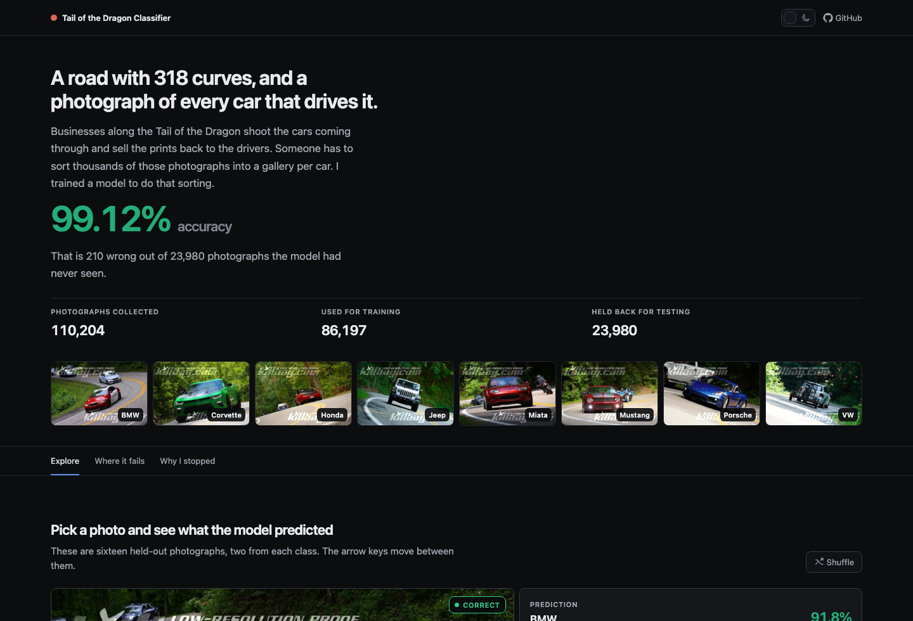
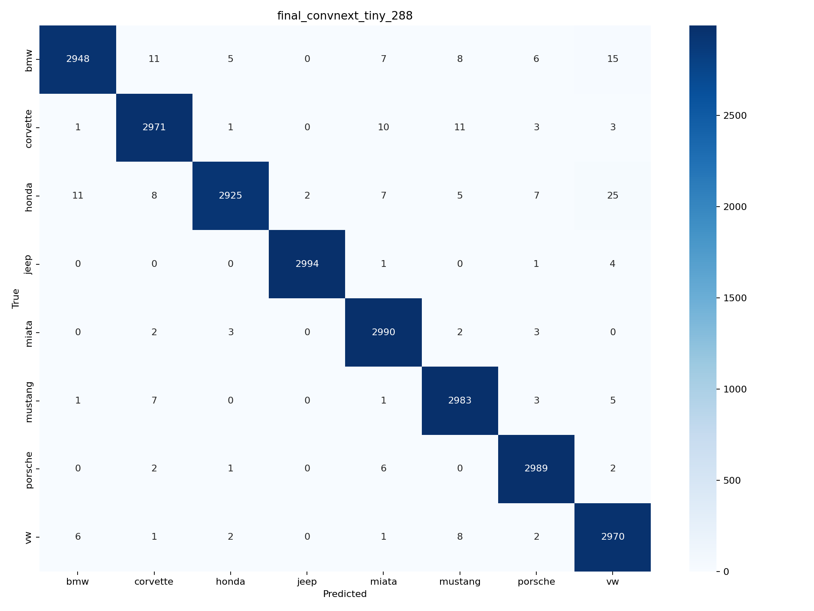
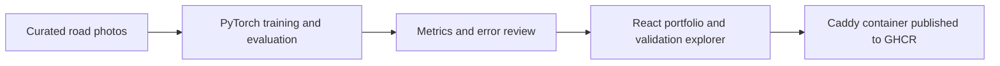

# Tail of the Dragon Car Classifier

[](https://github.com/ChaddBrenner/tail-of-dragon-car-classifier/actions/workflows/docker.yml)
[](https://www.chadd.blog/posts/car-type-detection/)

On a family trip to the Smoky Mountains, I noticed photographers along the Tail
of the Dragon sorting thousands of road photos into galleries for different
cars. That left me with a question: how much of that sorting could a model do?

This repository is where that question ended up: an eight-class ConvNeXt vehicle
classifier, a reproducible evaluation trail, and a React gallery that makes the
model's good and bad decisions easy to inspect.



## What I built

The project goes beyond a notebook and a headline accuracy number:

- A PyTorch training pipeline with controlled architecture searches,
  checkpointing, class-balanced sampling, augmentation, and metric exports.
- A held-out evaluation set of 23,980 images with class-level metrics,
  confidence buckets, and manually reviewed errors.
- Clickable confusion pairs for seeing where the model struggled.
- A static React/TypeScript portfolio experience with a photo explorer,
  failure analysis, and the stopping-rule narrative.
- A GitHub Actions release path that builds the app and publishes a multi-platform
  container with provenance and SBOM metadata.

The current gallery labels are `bmw`, `corvette`, `honda`, `jeep`, `miata`,
`mustang`, `porsche`, and `vw`.

## Result

The starting ConvNeXt checkpoint reached 77.09% validation accuracy. The final
model reached:

| Model | Image size | Validation images | Accuracy | Macro F1 | Top-3 accuracy |
| --- | ---: | ---: | ---: | ---: | ---: |
| ConvNeXt Tiny | 288 | 23,980 | **99.12%** | **0.9912** | **99.77%** |

That still left 210 misses, which turned out to be more useful than another
decimal place. I reviewed error sheets for high-confidence mistakes, narrow
decisions, and random misses. Many contained a bad label, an unreadable or
distant car, heavy occlusion, or more than one vehicle. Based on that review, I
treated roughly 99.0-99.3% as the practical ceiling for this version of the
dataset and stopped optimizing the score.

- [Read the dataset-noise review](reports/NOISE_REVIEW.md)
- [Open the model card](reports/MODEL_CARD.md)
- [See the experiment log](reports/EXPERIMENT_LOG.md)
- [Inspect the classification report](reports/classification_report.txt)



## How it fits together



The public experience is deliberately narrow. Visitors can explore saved
predictions and analysis for curated gallery images. There is no upload
endpoint, public inference API, database, or user account system.

## Run the gallery

A plain clone is enough; no large-file extension or model download is required:

```bash
cd web
npm ci
npm run dev
```

For the production container:

```bash
docker compose -f docker_deploy.yml up -d
```

The app listens on host port `8080` by default. The example Caddy configuration
in `deploy/Caddyfile.example` shows the reverse-proxy shape I use for deployment.

## Reproduce the training workflow

The raw dataset and local checkpoints are intentionally not committed. With the
same `train/<class>` and `validation/<class>` directory structure, create an
environment and run a smoke test:

```bash
python -m venv .venv
# macOS/Linux: source .venv/bin/activate
# Windows PowerShell: .\.venv\Scripts\Activate.ps1
python -m pip install -r requirements-train.txt
python training/train.py \
  --data-dir ../train_validation \
  --mode smoke \
  --output-dir runs/smoke
```

The longer search, final-training, and report commands are documented in
[`training/README.md`](training/README.md). The scripts write manifests beside
their artifacts so that a result can be traced back to its configuration.

## Repository map

```text
training/              Training, report, export, and gallery-generation tools
web/                   React/TypeScript portfolio app and curated analysis
reports/               Metrics, model card, error review, and final figures
deploy/                Caddy runtime and reverse-proxy examples
.github/workflows/     Validation and GHCR publishing
docker_deploy.yml      Self-hosted deployment
```

## Data and image notes

The model is specific to one road, one photo style, and eight broad gallery
labels. It is not a general vehicle-recognition system and should not be used
for identification, safety decisions, or fine-grained trim classification.

The raw training dataset is excluded from git. The public gallery contains a
small set of low-resolution, watermarked validation previews so the model's
behavior can be reviewed. Those previews are not offered as a reusable image
dataset, and the original photographers retain their rights to the source
images.

For the story behind the first version of the project, read
[Classifying Cars on the Tail of the Dragon](https://www.chadd.blog/posts/car-type-detection/).
